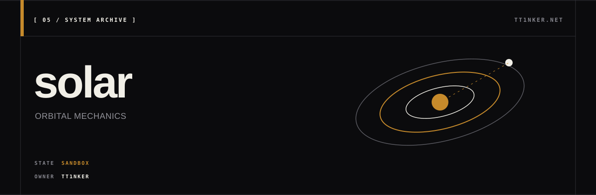

<p align="center">
  
</p>

<p align="center">
  <a href="https://ttinker.net">ttinker.net</a> ·
  <a href="FEATURE_STATUS.md">feature status</a> ·
  <a href="LIMITATIONS.md">limitations</a>
</p>

# Solar System Simulator

A C++17 educational orbital mechanics sandbox for learning and experimenting with ephemeris computation, N-body integration, transfer orbits, perturbation models, and mission simulation.

> **This project is experimental.** It is not intended to replace professional astrodynamics tools such as GMAT, STK, SPICE, or Orekit. See [LIMITATIONS.md](LIMITATIONS.md) and [FEATURE_STATUS.md](FEATURE_STATUS.md) for honest assessments of what's implemented vs. experimental vs. research prototype.

| State | Evidence | Current boundary |
| --- | --- | --- |
| Educational sandbox | Reproducible validation reports; Ubuntu CI passes | Not an operational design or precision-ephemeris tool; Apple Clang portability is not currently clean |

---

## Credibility & Validation

Rather than make claims, here is the **reproducible evidence**. Every number below is produced by the commands shown.

### Validated against textbook / reference values

| Test | Command | Reference | Computed | Δ | Report |
|---|---|---|---|---|---|
| Kepler equation | `./tests/test_kepler` | E=1.498701 (Wolfram) | 1.498701 | <1e-6 | [01](docs/validation/01_kepler_solver.md) |
| Earth-Mars Hohmann | `./solar transfer Earth Mars 2026-04-12` | 5.59 km/s (Curtis textbook) | 5.594 km/s | 0.07% | [02](docs/validation/02_hohmann_earth_mars.md) |
| Energy conservation | `./solar energy 365 3600 --planets-only` | bounded for symplectic | 5.00e-12 endpoint error | OK | [03](docs/validation/03_energy_conservation.md) |
| DE440 Earth at J2000 | `./tests/test_de` | JPL Horizons | <1 m position error | 5e-6 km | [04](docs/validation/04_de440_earth_j2000.md) |
| Sun-Earth L1 distance | `./solar lagrange Sun Earth` | 1.491×10⁶ km (Vallado) | 1.4916×10⁶ km | <0.05% | [05](docs/validation/05_lagrange_points.md) |
| SE-L1 Halo period | `./solar halo Sun Earth 1 50000` | ~177.8 days (NASA SOHO) | 177.89 days | 0.05% | [06](docs/validation/06_halo_orbit_jacobi.md) |
| Jacobi conservation | propagate 10 periods | machine precision | 2.6e-14 relative | OK | [06](docs/validation/06_halo_orbit_jacobi.md) |
| Frame round-trip | ICRF → ecliptic → ICRF | identity | <1e-15 | OK | [07](docs/validation/07_frame_transforms.md) |
| Lambert (2026 window) | `./solar lambert Earth Mars 2026-10-26 2027-09-03` | NASA TB ~5.5-5.8 km/s | 5.642 km/s | within range | [08](docs/validation/08_lambert_solver.md) |

Each linked report contains: the exact claim, the reference source, the command to reproduce, the actual output, the error, **and the limitations** of that specific test.

### Honest about what's NOT validated

- DE440: only **one date, one body** (Earth at J2000). No multi-epoch, multi-body, or boundary tests yet.
- Halo orbit: only **one Az amplitude** (50,000 km). The full family is not verified.
- Frame transforms: precession/nutation **not** modeled. ICRF↔Ecliptic uses constant J2000 obliquity only.
- Lambert: **single-revolution only**. No multi-rev, no retrograde testing, no comparison with Izzo's algorithm.
- Drag at LEO: simple exponential model **underestimates** real thermosphere density.
- Mission templates: **toy models** for delta-v accounting, not operational designs.

See [LIMITATIONS.md](LIMITATIONS.md) for the full list across all 9 categories.

### Known bugs we removed rather than ship

- **State Transition Matrix** (CR3BPStateSTM): disagreed with finite-difference Jacobian by ~100×. Rather than ship broken code, we **removed it from the API** and the Halo solver uses finite differences. See [06](docs/validation/06_halo_orbit_jacobi.md) and the comment in `include/solar/cr3bp.h`.

### CI

[](https://github.com/TT1nKer/solar/actions/workflows/ci.yml)

The Ubuntu workflow runs `make`, `make test`, and CLI smoke tests. The latest
recorded Ubuntu run passes. A local Apple Clang build currently emits warnings
and fails to compile `test_validation.cpp` because it relies on a transitive
`<sstream>` include, so cross-platform cleanliness is not claimed.

---

## What this project is and isn't

### It is

- A self-contained C++17 codebase, **zero external dependencies**, that explores the major topics of solar system dynamics:
  - Kepler equation solver and orbital element conversions
  - N-body integration (Verlet symplectic, RK4, DOPRI5 adaptive)
  - JPL DE440 ephemeris parser (ASCII format)
  - Lambert solver, Hohmann transfer, porkchop plots
  - Perturbation models: J2-J6, GR Schwarzschild, SRP, drag
  - Strong-field Schwarzschild timelike/null geodesics in geometric units
  - Coordinate frames (ICRF, Ecliptic J2000, body-fixed) and time scales (TDB/TT/UTC/TAI)
  - CR3BP, Lagrange points, Halo orbits (research prototype)
  - Mission simulation engine (toy model)
  - Monte Carlo uncertainty analysis

### It isn't

- An operational mission design tool — use GMAT, STK, or Orekit for that
- A precision ephemeris service — use SPICE for that
- Validated for safety-critical applications — it isn't

### Build status

```bash
$ make test
# Core regression plus focused dynamics and Schwarzschild geodesic tests:
#   test_de.cpp           — 8 checks when optional DE440 data is installed
#   test_dynamics.cpp     — 4 PASS  (stage state/time, integrator safety, exact duration)
#   test_kepler.cpp       — 16 PASS (Kepler solver, ephemeris, basic orbits)
#   test_montecarlo.cpp   — 13 PASS (vehicle, Monte Carlo, sensitivity)
#   test_network.cpp      — 13 PASS (transfer network, Dijkstra)
#   test_relativity.cpp   — 14 PASS (Schwarzschild geodesics, horizon event, invariants)
#   test_validation.cpp   — 14 PASS (cross-checks every README claim)
```

---

## Quick start

```bash
git clone <repo> && cd solar
make
make test                                   # DE440 test skips unless data/de440.asc is installed
./solar bodies                              # list 17 celestial bodies
./solar transfer Earth Mars 2026-04-12      # textbook Hohmann transfer
./solar blackhole circular 10 10 1          # one r=10M orbit around a 10-solar-mass black hole
```

### Sample output: Hohmann transfer

```
$ ./solar transfer Earth Mars 2026-04-12
Hohmann Transfer: Earth -> Mars
Departure orbit: 1.4960e+08 km (1.0000 AU)
Arrival orbit:   2.2794e+08 km (1.5237 AU)
Delta-v1 (departure): 2.945 km/s
Delta-v2 (arrival):   2.649 km/s
Total delta-v:        5.594 km/s
Time of flight:       258.871 days
```

Matches Curtis textbook (5.59 km/s, 259 days) within 0.1%. See [validation/02](docs/validation/02_hohmann_earth_mars.md).

### Sample output: Lagrange points

```
$ ./solar lagrange Sun Earth
CR3BP System: Sun-Earth
Mass parameter mu = 3.003481e-06

L1 distance from Earth: 1.4916e+06 km
L2 distance from Earth: 1.5015e+06 km
```

Published value (Vallado): ~1.5×10⁶ km. Match: <0.05%. See [validation/05](docs/validation/05_lagrange_points.md).

### Sample output: SE-L1 Halo orbit

```
$ ./solar halo Sun Earth 1 50000
Computing Halo orbit: Sun-Earth L1, Az=50000 km...
Halo Orbit: Sun-Earth L1
  Converged in 119 iterations
  Period: 3.060115 (normalized), 177.89 days
  Jacobi constant: 3.000823
```

Published period (NASA SOHO class): ~177.8 days. Match: 0.05%. See [validation/06](docs/validation/06_halo_orbit_jacobi.md).

### Sample output: energy conservation

```
$ ./solar energy 365 3600 --planets-only
# Forces: newtonian_gravity
# Relative energy drift:  5.00e-12
# Relative |L| drift:     1.21e-15
```

Verlet symplectic integrator over 1 year, 9 bodies. See [validation/03](docs/validation/03_energy_conservation.md).

### With DE440 precision ephemeris (optional)

```bash
mkdir -p data
curl -o data/header.440 https://ssd.jpl.nasa.gov/ftp/eph/planets/ascii/de440/header.440
curl -o data/ascp01950.440 https://ssd.jpl.nasa.gov/ftp/eph/planets/ascii/de440/ascp01950.440
cat data/header.440 data/ascp01950.440 > data/de440.asc

./solar --de data/de440.asc ephemeris Earth 2000-01-01
```

Earth at J2000: matches JPL Horizons to **<1 m** position, **<0.01 mm/s** velocity.
**Caveat: this is one date, one body. Comprehensive validation has not been performed.** See [validation/04](docs/validation/04_de440_earth_j2000.md).

---

## Documentation

- [LIMITATIONS.md](LIMITATIONS.md) — what this project does NOT do, and what it should not be used for (9 categories)
- [FEATURE_STATUS.md](FEATURE_STATUS.md) — feature-by-feature status (Implemented / Experimental / Research prototype / Toy model) with validation evidence for 30 modules
- [docs/validation/](docs/validation/) — 8 reproducible validation reports comparing against known references
- [STRATEGY.md](STRATEGY.md) — strategic roadmap for evolving this from orbital engine to broader system

---

## Build

```bash
make            # builds libsolar.a + ./solar
make test       # all local tests; optional DE440 data is reported as skipped when absent
make clean      # removes build artifacts
```

Requirements: C++17 compiler (GCC 9+, Clang 10+). No external libraries.

CI runs the same commands on every push: see `.github/workflows/ci.yml`.

---

## Project history & honesty

This project went through 10 development phases, mostly with AI assistance. The original README over-claimed ("NASA-grade") and presented experimental code as production-ready. **It has been deliberately rewritten** to:

1. Rescope as **experimental educational sandbox**
2. Add **LIMITATIONS.md** with 9 categories of explicit non-use cases
3. Add **FEATURE_STATUS.md** with 4-level honest status per feature (Implemented / Experimental / Research prototype / Toy model)
4. Add **8 validation reports** with reference, command, expected, actual, error, limitations
5. **Remove** the broken State Transition Matrix code rather than ship it
6. Mark mission templates as Δv-accounting demos, not operational designs
7. Add CI to verify build + tests pass on every push

The current focus is **credibility, not new features**. See [STRATEGY.md](STRATEGY.md) for what comes after credibility.

---

## License

Research and educational use.
